# Donathell

An advanced, real-time donation platform imitation designed with a modern glass morphism aesthetic.

[](https://react.dev/)
[](https://vitejs.dev/)
[](https://tailwindcss.com/)
[](https://nodejs.org/)
[](https://expressjs.com/)
[](https://www.mongodb.com/)

**Backend Repository:** [DolgopolovArseniy/donathell-back](https://github.com/DolgopolovArseniy/donathell-back)

**Developer Contact:**

- [LinkedIn](https://www.linkedin.com/in/arseniydolgopolov/)
- [Email](mailto:arseniy.dolgopolov@outlook.com)

---

## Overview

Donathell is a full-stack donation platform with real-time updates via SSE, JWT authentication, and an analytics dashboard. Built as a learning project to explore modern React patterns and backend architecture.

---

## UI Showcase

### Real-time SSE Action & Advanced Filtering

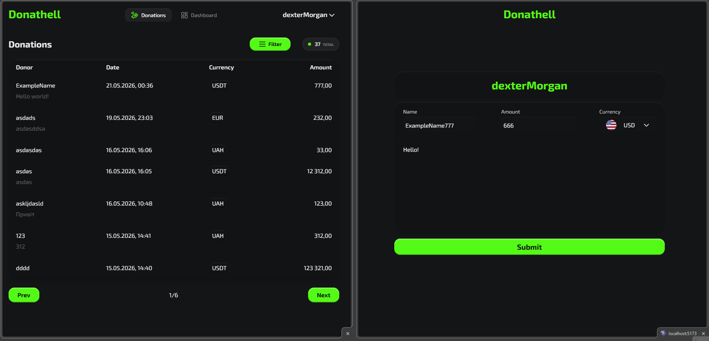
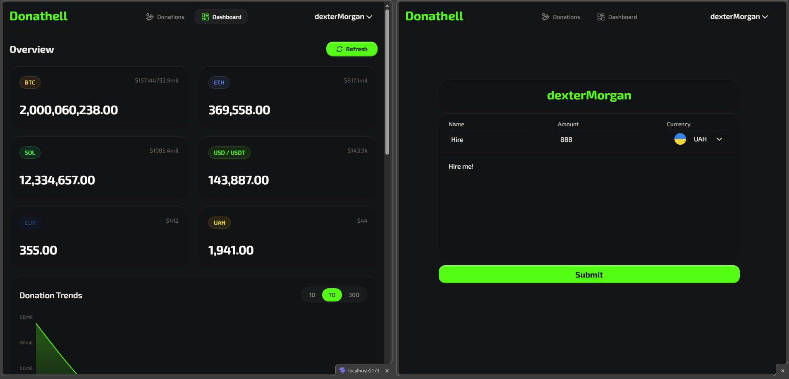

### Responsive Interface

| Desktop View                                                | Mobile View                                                              |
| :---------------------------------------------------------- | :----------------------------------------------------------------------- |
| 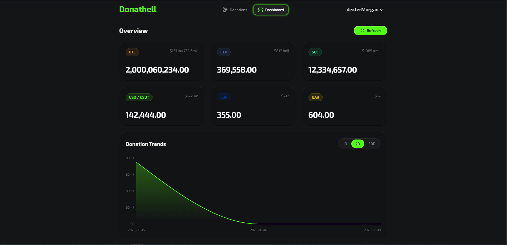 | 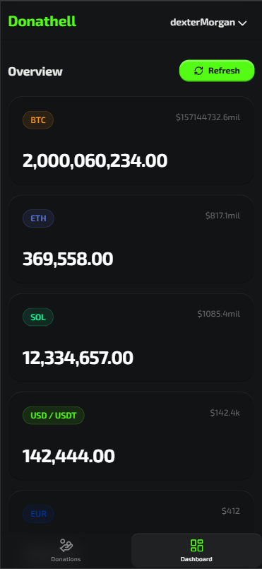         |
| 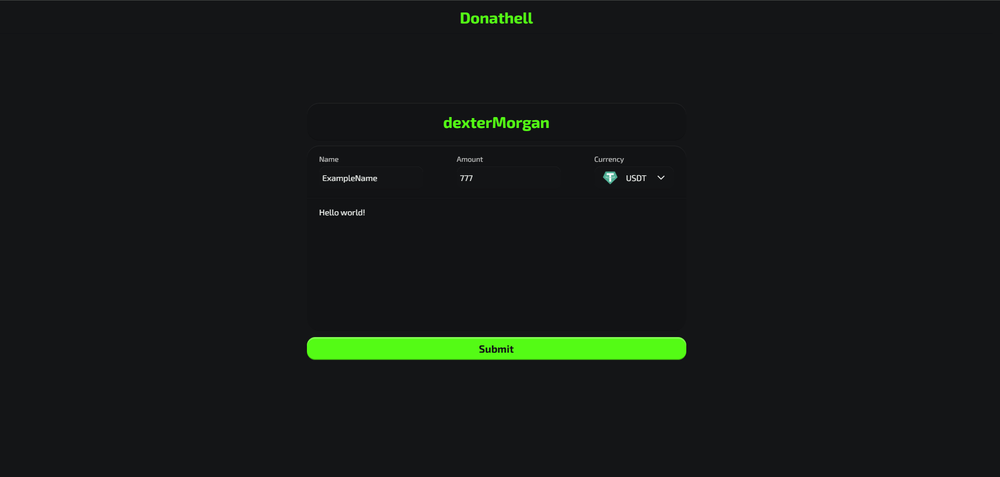                 | 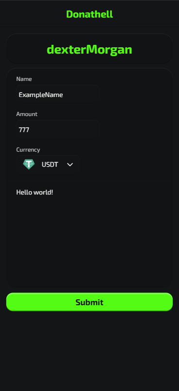                |
| 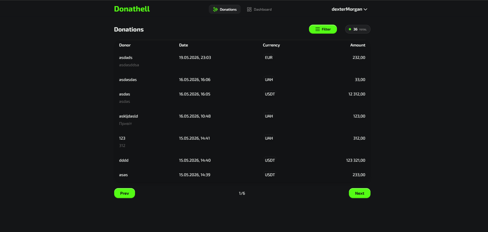    | 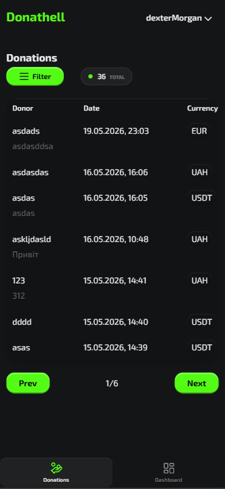   |
| 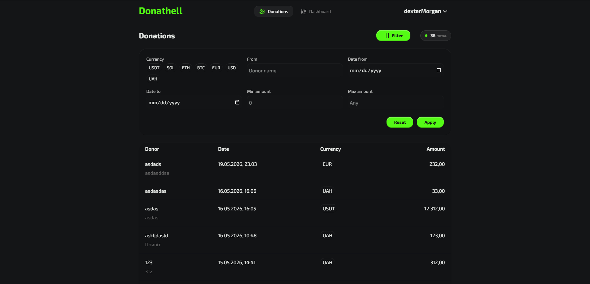  | 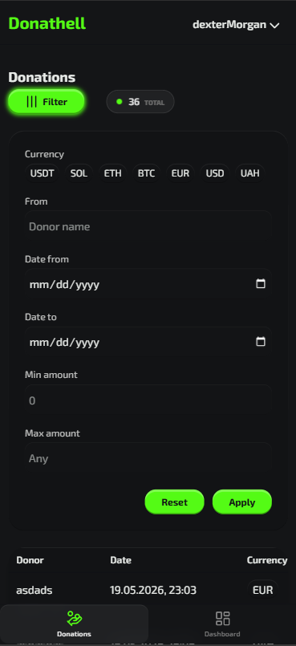 |
| 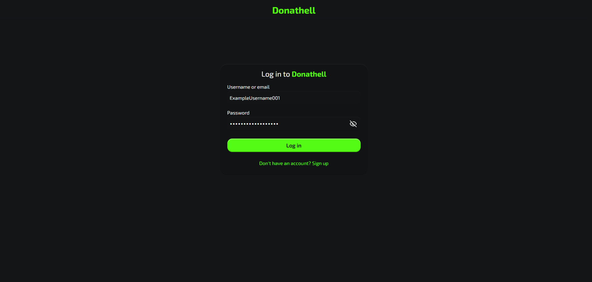                   | 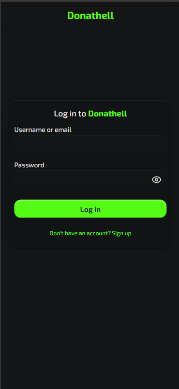                  |
| 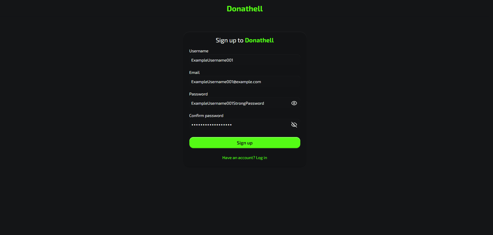                 | 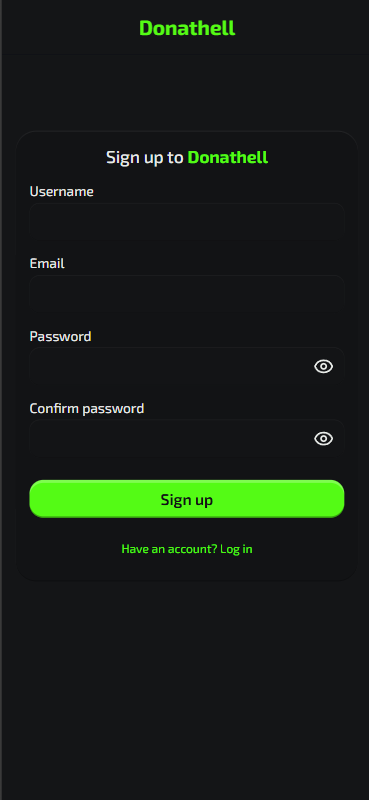                |

---

## Tech Stack Architecture

### Frontend

- **React 19 & Vite:** Providing blazing-fast compilation, hot module replacement, and modern concurrent rendering.
- **Tailwind CSS v4:** Using the latest utility-first styling engine to handle complex responsive design.
- **React Router 7:** Managing complex routing schemas and protecting authenticated routes.
- **Recharts:** Rendering beautiful, dynamic, and responsive data analytics charts.

### Backend

- **Node.js & Express 5:** Handling robust routing and security middlewares.
- **MongoDB & Mongoose:** Enabling flexible schema design and powerful aggregations.
- **Redis (ioredis):** Used strictly as a Pub/Sub mechanism to cleanly handle Server-Sent Events (SSE) and seamlessly broadcast real-time donation data across the application.

---

## AI-Assisted Development

This project was built with a developer-first approach, where AI acted as an advanced pair programmer rather than a blind code generator.

- **Developer-Driven Architecture:** I architected the backend entirely by myself, defining the data structures, REST API contracts, and the SSE mechanisms. Based strictly on this foundation, AI was utilized to assist with building the Dashboard UI elements and structuring tests, but I manually reviewed, validated, and controlled every assertion to ensure correctness.
- **Component Visuals:** The sophisticated glass morphism aesthetic was entirely engineered by me. I designed the creative direction, layered shadowing, and dynamic feel, and then used AI as a tool to rapidly translate my exact design vision into precise Tailwind CSS.
- **Strategic Problem Prevention:** Instead of just debugging broken code, AI was leveraged during the planning phases to foresee structural bottlenecks, map out optimal component structures, and handle prop-drilling efficiently before any code was even written.
- **Learning & Mental Models:** AI wasn't just a coding output tool; it was a senior mentor. I used it to break down complex asynchronous logic and understand data flow patterns, allowing me to build a complete "mental map" of the system and fundamentally grasp _why_ the architecture works the way it does.
- **Agent Ecosystem:** Towards the end of the project, I integrated an advanced IDE setup utilizing Antigravity rules, workflows, GitHub MCP, and Context7 to manage deep codebase context.

---

## Future Features

- ⚡ **Bun Migration:** Move the backend from Node.js to Bun to achieve superior execution speed.
- 📊 **CSV Export:** Implement functionality for content creators to download their complete donation history.
- 🎯 **Goals & Targeted Gatherings:** Introduce a feature where users can set up targeted fundraising campaigns (e.g., "New Camera Setup: $500") with visual progress bars.

---

## Local Setup

### Frontend

```bash
# Clone the repository
git clone https://github.com/DolgopolovArseniy/donathell-front.git
cd donathell-front

# Install dependencies
npm install

# Start the development server
npm run dev
```

### Backend

```bash
# Clone the repository
git clone https://github.com/DolgopolovArseniy/donathell-back.git
cd donathell-back

# Install dependencies
npm install

# Setup your config.env file with MongoDB URI, Redis URI, and JWT Secret
# ...

# Start the development server
npm run dev
```
